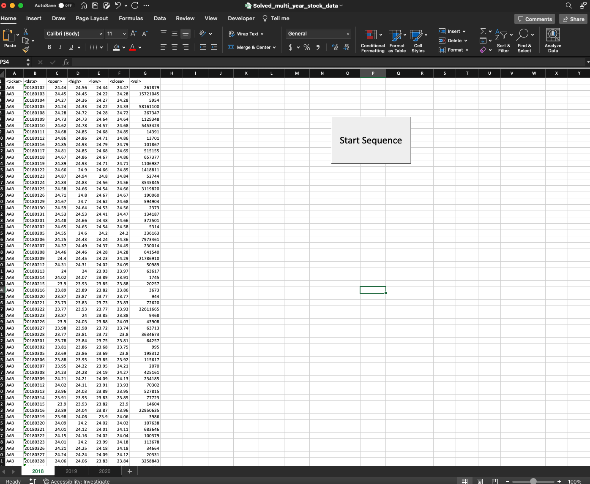
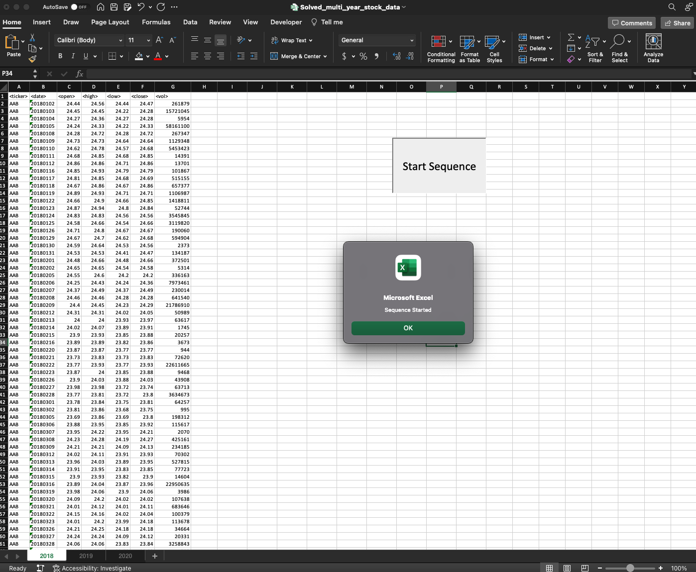
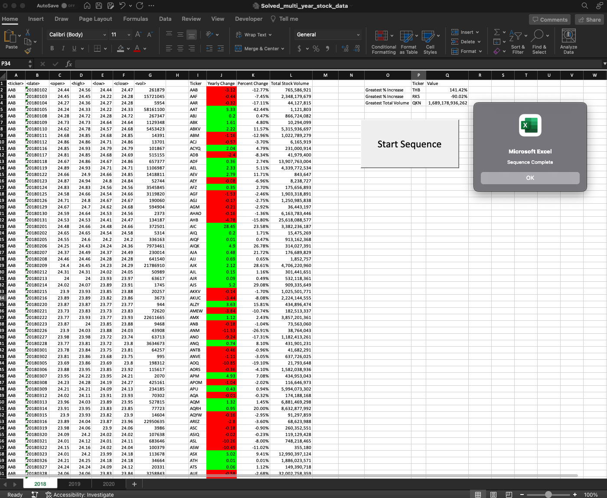

# VBA-challenge
Completed by Daniel Stephens

## About this project

The purpose of this script is to parse through a large dataset of stock trading volume and determine the performance of each stock throughout the year. Running the script will output the total trading volume, value change, and percentage change for each stock. Additionally the highest and lowest performing stocks, as well as the stock with the highest trading volume is returned. The script will complete the output for every sheet within the workbook. 

## Accessing resources for this project

The completed script and excel file can be accessed in the [Solved_Code/Resources](Solved_Code/Resources) folder within this repo.

Screenshots with outputs generated by the script can be accessed in the [Solved_Code/Images](Solved_Code/Images) folder within this repo.

## Running the script

Open the Solved_multi_year_stock_data.xlsm file in Excel and enable Macros for the workbook

Click the ***Run Sequence*** button to start the script

A dialog box will appear to confirm that the script has been started. Click ***Ok*** to confirm. 

After the script has completed, a second dialog box will appear. 

